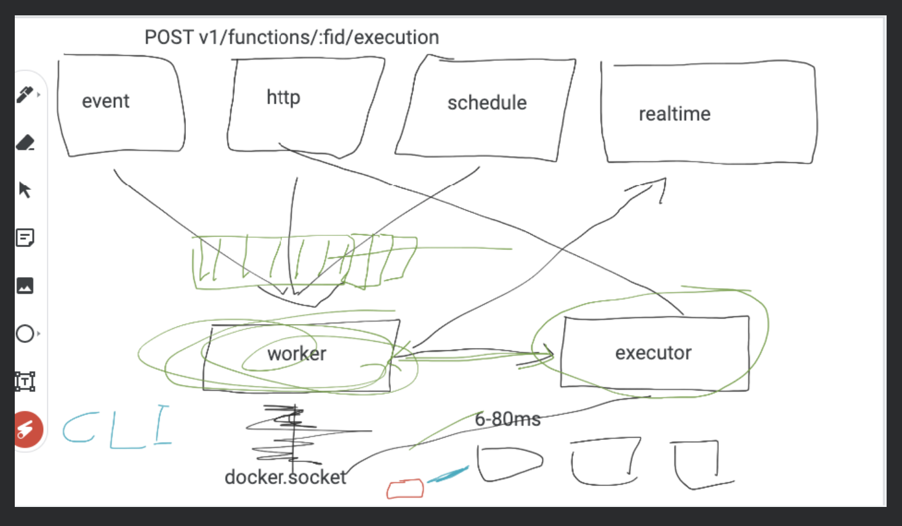

# Title <!-- What do you want to call your `awesome_feature`? -->

- Implementation Owner: @lohanidamodar
- Start Date: 10-08-2021
- Target Date: N/A
- Appwrite Issue:
  [Is this RFC inspired by an issue in appwrite](https://github.com/appwrite/appwrite/issues/)

## Summary

[summary]: #summary

<!-- Brief explanation of the proposed contribution. Write your answer below. -->
We are completely redesigning our Cloud Functions Runtime environments this time using web server.

## Problem Statement (Step 1)

[problem-statement]: #problem-statement

**What problem are you trying to solve?**

<!-- Write your answer below. -->

This change is in the process to make Appwrite Cloud functions more efficient as well as allow synchronous execution of Functions. This should also reduce the function's execution time in subsequent execution by a lot.

**What is the context or background in which this problem exists?**

<!-- Write your answer below. -->

While working with Appwrite Cloud Functions at the moment, the execution time are notable. Everytime the code has to be executed, the runtime loads and executes the code file using Cloud Function Runtime's docker container. There is an overhead of container starting and executing.

Also at the moment, there is no way to make the Function's execution synchronous.

**Once the proposal is implemented, how will the system change?**

<!-- Write your answer below. -->

Well, the process of executing Cloud Functions will completely change from Docker based execution to web requests. So the Functions worker will have to be modified accordingly to work with new function's runtimes.

<!-- Please avoid discussing your proposed solution. -->

## Design proposal (Step 2)

[design-proposal]: #design-proposal

<!--
This is the technical portion of the RFC. Explain the design in sufficient detail keeping in mind the following:

- Its interaction with other parts of the system is clear
- It is reasonably clear how the contribution would be implemented
- Dependencies on libraries, tools, projects or work that isn't yet complete
- New API routes that need to be created or modifications to the existing routes (if needed)
- Any breaking changes and ways in which we can ensure backward compatibility.
- Use Cases
- Goals
- Deliverables
- Changes to documentation
- Ways to scale the solution

Ensure that you include examples, code-snippets etc. to allow the community to understand the proposed solution. **It would be best if the examples use naming conventions that you intend to use during the actual implementation so that changes can be suggested early on during the development.**

Write your answer below.

-->


1. It will require web server
2. It receives path to extracted execution code files
3. entry file name / for some, entry function - set default main() - entry() - execute()
4. A signature for web server, that has request/response model
5. Wildcard endpoint, that accepts request to any endpoint
6. Handle dependencies of the function - Build step for every runtime (avoid uploading dependencies), handling conflicts
7. Prevent code execution outside of the controller endpoint
8. For statically typed langugage, as dynamic import is not possible, user code volume must be predefined and signature must be predefined
9. Timeout handling from executor, canceling Request from executor so that web server takes care of the rest

- The function should export the callback that runtime can import and pass as callback to the request

```js
on('/', callback) {
    //callback is what cloud functions should provide
}

//callback signature
callback(req, res);
```
1. Make sure request object is same in every language
   1. Headers
   2. Cookies
   3. Payload
   4. Environment variables
   5. Query Params
2. Make sure response object is same in every language
   1. send  - accept string
   2. status

3. Some kind of dependencies for each cloud functions language that has the type definitions for auto completion and type safety

Stage 1:
## Node JS
- micro/express/fastify

## Deno
- Native HTTP server

## Dart
- Shelf package

Stage 2:
## PHP
- swoole with utopia

## Python
- Flask

## Ruby
- https://dev.to/leandronsp/web-basics-a-simple-http-server-in-ruby-2jj4

Stage 3:
## Kotlin
- Spring
- Compiled

## .Net
- compiled

---

## Rust
- Compiled

## Swift
- Compiled

## GO
- native web server

### Prior art

[prior-art]: #prior-art

<!--

Discuss prior art, both the good and the bad, in relation to this proposal. A
few examples of what this can include are:

- Does this functionality exist in other software and what experience has their
  community had?
- For other teams: What lessons can we learn from what other communities have
  done here?
- Papers: Are there any published papers or great posts that discuss this? If
  you have some relevant papers to refer to, this can serve as a more detailed
  theoretical background.

This section is intended to encourage you as an author to think about the
lessons from other software, provide readers of your RFC with a fuller picture.
If there is no prior art, that is fine - your ideas are interesting to us
whether they are brand new or if it is an adaptation from other software.

Write your answer below.
-->

### Unresolved questions

[unresolved-questions]: #unresolved-questions

<!-- What parts of the design do you expect to resolve through the RFC process before this gets merged? -->

<!-- Write your answer below. -->

### Future possibilities

[future-possibilities]: #future-possibilities

<!-- This is also a good place to "dump ideas", if they are out of scope for the RFC you are writing but otherwise related. -->

<!-- Write your answer below. -->

## Ref

- 
- https://github.com/fission/environments